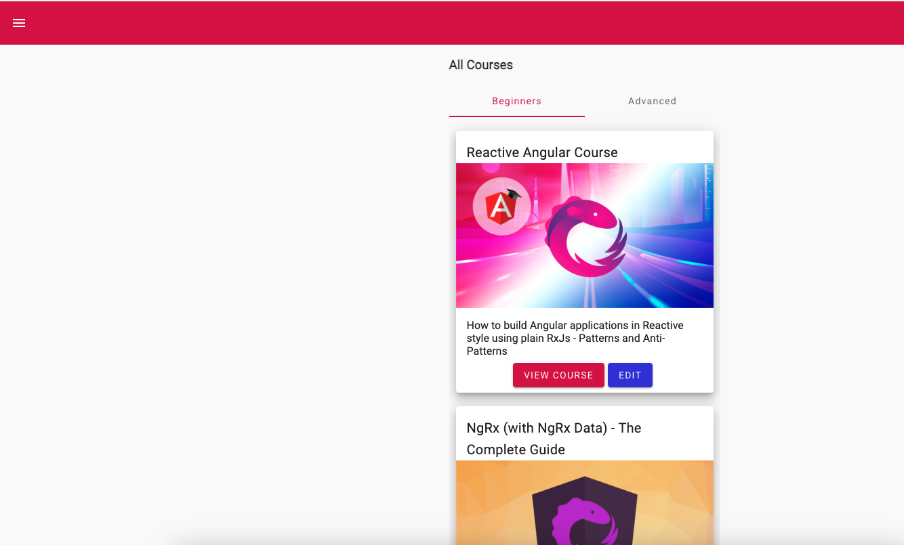
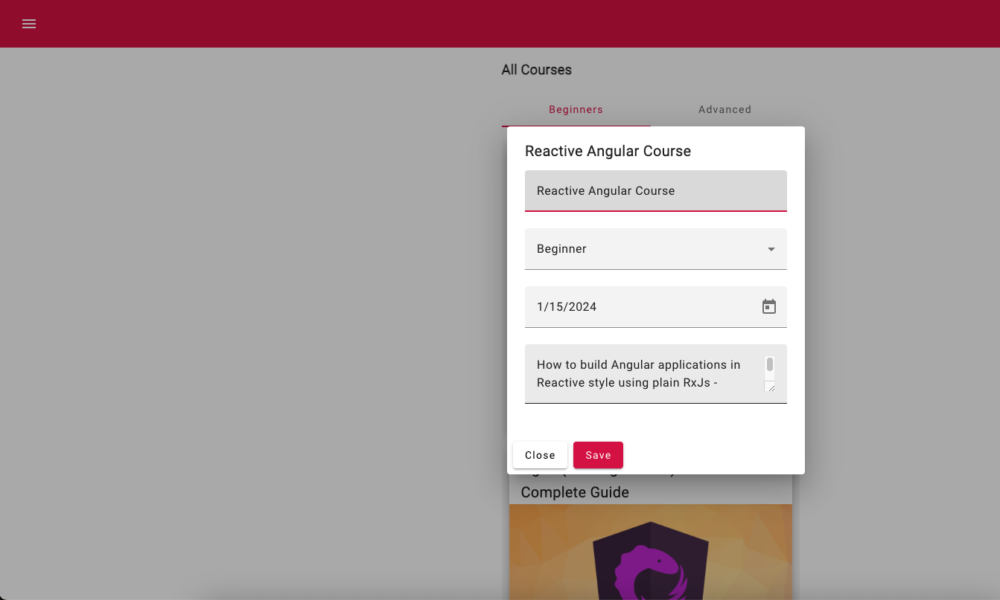
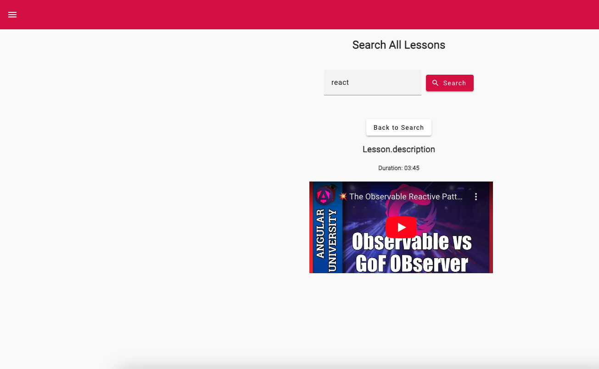

## RAMAS
hay 3 ramas
1-start que es el proyecto inicial, la dejo tal cual para notar los cambios
2-progress es en la q trabajo y van a estar todos los commits
main es el resultado final

## Samples

## The Reactive Angular Course

This repository contains the code of the [Reactive Angular Course](https://angular-university.io/course/reactive-angular-course).

This course repository is updated to Angular v17.

# Installation pre-requisites

Please use Node 18 long-term support (LTS) version.

# Installing the Angular CLI

With the following command the angular-cli will be installed globally in your machine:

    npm install -g @angular/cli 

# How To install this repository

We can install the master branch using the following commands:

    git clone https://github.com/angular-university/reactive-angular-course.git
    
This repository is made of several separate npm modules, that are installable separately. For example, to run the au-input module, we can do the following:
    
    cd reactive-angular-course
    npm install

Its also possible to install the modules as usual using npm:

    npm install 

NPM 5 or above has the big advantage that if you use it you will be installing the exact same dependencies than I installed in my machine, so you wont run into issues caused by semantic versioning updates.

This should take a couple of minutes. If there are issues, please post the complete error message in the Questions section of the course.

# To Run the Development Backend Server

In order to be able to provide realistic examples, we will need in our playground a small REST API backend server. We can start the sample application backend with the following command:

    npm run server

This is a small Node REST API server.

# To run the Development UI Server

To run the frontend part of our code, we will use the Angular CLI:

    npm start 

The application is visible at port 4200: [http://localhost:4200](http://localhost:4200)

# Important 

This repository has multiple branches, have a look at the beginning of each section to see the name of the branch.

At certain points along the course, you will be asked to checkout other remote branches other than master. You can view all branches that you have available remotely using the following command:

    git branch -a

  The remote branches have their starting in origin, such as for example 1-navigation-and-containers.

We can checkout the remote branch and start tracking it with a local branch that has the same name, by using the following command:

      git checkout -b section-1 origin/1-navigation-and-containers

It's also possible to download a ZIP file for a given branch,  using the branch dropdown on this page on the top left, and then selecting the Clone or Download / Download as ZIP button.

## RxJs and Reactive Patterns Angular Architecture Course

If you are looking for the RxJs and Reactive Patterns Angular Architecture Course code, the repo with the full code can be found here:

[RxJs and Reactive Patterns Angular Architecture Course](https://angular-university.io/course/reactive-angular-architecture-course)

